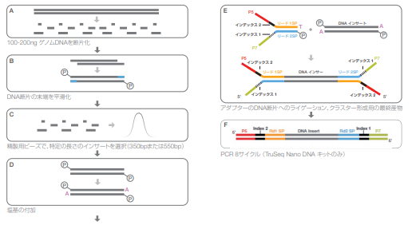
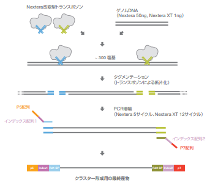
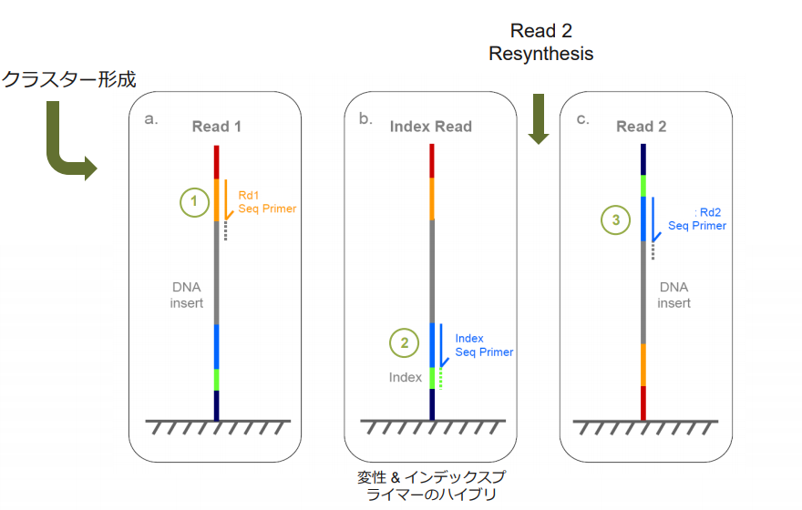

## TL;DR

次世代シーケンサー(NGS)解析技術の発展に伴い、比較的安価にシーケンスを行うことができるようになってきています。NGS解析を行うにあたって重要なライブラリ調整の原理と、シーケンサーの挙動についてまとめていきます。

## ライブラリ調整について
Illumina社のNGS技術は`sequence by synthesis (SBS)`と呼ばれる技術が使われています。`SBS`を使うには、アダプターと呼ばれる認識配列が必要です。
ライブラリ調整とは、様々な反応を駆使して、読みたいDNAの両端にアダプターをつける反応です。このアダプターとして使われる配列も色々ありますが、2021現在において最もよく使われているのはTruseqのアダプターと、Nexteraのアダプターだと思われます。その他のアダプターなどについては[Illumina adapter sequences document](https://teichlab.github.io/scg_lib_structs/data/illumina-adapter-sequences-1000000002694-14.pdf)を参照してください。

よく使われている反応については、[弊ブログの記事](https://illumination-k.dev/posts/biology/library_construction_reaction)などを参照していただけると幸いです。

### ライブラリの構造

基本的に、ライブラリは以下の要素で構成されています。名前は正式名称ではありませんが、便宜上本記事ではこれらの名前を使わせていただきます。

||説明|代表例|
|---|---|---|
|フローセル結合配列|フローセルとハイブリダイズするのに必要な配列|`P5`, `P7` etc.,|
|インデックス配列|マルチサンプルを扱うときに使う配列|`i5`, `i7` etc.,|
|アダプター配列|シーケンスプライマーが結合する配列|`Truseq Read`, `Nextera Read` etc.,|
|Insert DNA|実際に解析される配列||

実際のライブラリ構造を見て見ると、それらの要素が全て入っているのがわかると思います。

### Truseq Single Index

<Seq
    fchain={<><P5>AATGATACGGCGACCACCGAGATCTACAC</P5><S5>TCTTTCCCTACACGACGCTCTTCCGATCT</S5>-insert-<S7>AGATCGGAAGAGCACACGTCTGAACTCCAGTCAC</S7><T7>NNNNNNNN</T7><P7>ATCTCGTATGCCGTCTTCTGCTTG</P7></>}
    rchain={<><P5>TTACTATGCCGCTGGTGGCTCTAGATGTG</P5><S5>AGAAAGGGATGTGCTGCGAGAAGGCTAGA</S5>-insert-<S7>TCTAGCCTTCTCGTGTGCAGACTTGAGGTCAGTG</S7><T7>NNNNNNNN</T7><P7>TAGAGCATACGGCAGAAGACGAAC</P7></>}
    annotation={<>      <P5>Illumina P5</P5>                   <S5>Truseq Read 1</S5>                        <S7>Truseq Read 2</S7>                 <T7>i7</T7>        <P7>Illumina P7</P7></>}
/>

### Truseq Dual Index

<Seq
fchain={<><P5>AATGATACGGCGACCACCGAGATCTACAC</P5><T7>NNNNNNNN</T7><S5>ACACTCTTTCCCTACACGACGCTCTTCCGATCT</S5>-insert-<S7>AGATCGGAAGAGCACACGTCTGAACTCCAGTCAC</S7><T7>NNNNNNNN</T7><P7>ATCTCGTATGCCGTCTTCTGCTTG</P7></>}
rchain={<><P5>TTACTATGCCGCTGGTGGCTCTAGATGTG</P5><T7>NNNNNNNN</T7><S5>TGTGAGAAAGGGATGTGCTGCGAGAAGGCTAGA</S5>-insert-<S7>TCTAGCCTTCTCGTGTGCAGACTTGAGGTCAGTG</S7><T7>NNNNNNNN</T7><P7>TAGAGCATACGGCAGAAGACGAAC</P7></>}
annotation={<>      <P5>Illumina P5</P5>               <T7>i5</T7>            <S5>Truseq Read 1</S5>                          <S7>Truseq Read 2</S7>                 <T7>i7</T7>        <P7>Illumina P7</P7></>}
/>

### Nextera Dual Index

<Seq
fchain={<><P5>AATGATACGGCGACCACCGAGATCTACAC</P5><T7>NNNNNNNN</T7><S5>TCGTCGGCAGCGTC</S5><Me>AGATGTGTATAAGAGACAG</Me>-insert-<Me>CTGTCTCTTATACACATCT</Me><S7>CCGAGCCCACGAGAC</S7><T7>NNNNNNNN</T7><P7>ATCTCGTATGCCGTCTTCTGCTTG</P7></>}
rchain={<><P5>TTACTATGCCGCTGGTGGCTCTAGATGTG</P5><T7>NNNNNNNN</T7><S5>AGCAGCCGTCGCAG</S5><Me>TCTACACATATTCTCTGTC</Me>-insert-<Me>GACAGAGAATATGTGTAGA</Me><S7>GGCTCGGGTGCTCTG</S7><T7>NNNNNNNN</T7><P7>TAGAGCATACGGCAGAAGACGAAC</P7></>}
annotation={<>       <P5>Illumina P5</P5>              <T7>i5</T7>             <S5>Next</S5><Me>era Read 1</Me>                                <Me>Next</Me><S7>era Read 2</S7>        <T7>i7</T7>         <P7>Illumina P7</P7></>}
/>

## ライブラリ調整法

これらのライブラリがどうやって作成されるかのかを順番に見ていきます。ライブラリ調整の基本的な流れは、
1. 数百bp程度の二本鎖DNAを作る
2. それらのDNAに対して、何らかの方法でSBSに必要な配列を追加していく
3. ビーズやゲルなどで精製、PCR増幅を行う

といった流れが一般的です。今回は基本であるDNAに関するライブラリ調整に絞って説明します。

### Truseq[^1]

1. [Covaris](https://www.technosaurus.co.jp/categories/view/488)などの超音波破砕などで100-200 ngゲノムDNAを断片化します。
2. T4 DNA polymeraseやkelnow fragmentを用いてDNA断片の末端を平滑化、リン酸化します。
3. ビーズなどを使って特定サイズのDNAのみを選択的に取得します。
4. 平滑化したDNA断片の末端をKlenow Fragmentを用いて、A-tailを付与します([参考1](https://international.neb.com/protocols/2013/11/06/a-tailing-with-klenow-fragment-3-5-exo), [参考2](https://academic.oup.com/nar/article/45/10/e79/2948436))。
5. T4 DNA ligaseでライゲーションし、アダプターを付加します。
6. PCRで増幅します。
7. シーケンスへ。

> [次世代シーケンサー用ライブラリー調製試薬](https://www.nebj.jp/jp/Flyer/NEBNEXT.pdf)

### Nextera

1. TransposaseをつかってゲノムDNAを~300 bp程度に断片化し、同時に必要なIndexを付加します。
2. 付加した配列を鋳型にするプライマーを使って、PCRで残りのアダプターを付加します。
3. シーケンスへ

> [次世代シーケンサー用ライブラリー調製試薬](https://www.nebj.jp/jp/Flyer/NEBNEXT.pdf)

## 実際どういうふうにシーケンスが読まれているのか

まず最初に単語として、インデックス配列が1つのものをシングルインデックス、インデックス配列が2つあるものをデュアルインデックス配列と呼びます。[このスライド](https://www.adres.ehime-u.ac.jp/news/NGS1.pdf)が非常に詳しいです。

### マルチプレックス法

シーケンサーにライブラリを入れるとき、1つのライブラリではなく複数のライブラリを同時に流します。その際に、そのリードがどのライブラリ由来なのかを判別するために使われるのがインデックス配列です。つまり、1つのライブラリにユニークなIDを配列という形で付与することで、1回のシーケンスで複数のサンプルを同時に解析し、後でそれを区別するための仕組みです。デュアルインデックスにすると、インデックス配列が2個あるので、インデックス配列の組み合わせがユニークなIDとなります。

> [NGS超入門](https://www.adres.ehime-u.ac.jp/news/NGS1.pdf)

### シングルインデックスかつペアエンドの場合

1. Read1側からinsert-DNAのシーケンスを読みます** (a)** (ex., Truseq Read1, Nextera Read1)。
2. Read2側からインデックス配列を読みます **(b)** (ex., Truseq Read2, Nextera Read2)。
3. ブリッジする。
4. Read2側からinset-DNAのシーケンスを読みます **(c)**。

> [NGS超入門](https://www.adres.ehime-u.ac.jp/news/NGS1.pdf)

### デュアルインデックスかつペアエンドの場合

1. Read1側からinsert-DNAのシーケンスを読みます(ex., Truseq Read1, Nextera Read1)。
2. Read2側からインデックス配列を読みます(ex., Truseq Read2, Nextera Read2)。
3. ブリッジしたあとP5側からインデックス配列2を読みます。
4. Read2側からinset-DNAのシーケンスを読みます。

> [NGS超入門](https://www.adres.ehime-u.ac.jp/news/NGS1.pdf)

## 参考文献

- [Library sequencing](https://teichlab.github.io/scg_lib_structs/methods_html/Illumina.html)
- [次世代シーケンサー向けライブラリー調製キット
](https://jp.illumina.com/content/dam/illumina-marketing/apac/japan/documents/pdf/brochure_libraryprep_dna.pdf)
- [次世代シーケンサー用ライブラリー調製試薬](https://www.nebj.jp/jp/Flyer/NEBNEXT.pdf)
- [A-Tailing with Klenow Fragment (3'-->5' exo-)](https://international.neb.com/protocols/2013/11/06/a-tailing-with-klenow-fragment-3-5-exo)
- [Marie-Theres Gansauge, Tobias Gerber, Isabelle Glocke, Petra Korlević, Laurin Lippik, Sarah Nagel, Lara Maria Riehl, Anna Schmidt, Matthias Meyer, Single-stranded DNA library preparation from highly degraded DNA using T4 DNA ligase, Nucleic Acids Research, Volume 45, Issue 10, 2 June 2017, Page e79, https://doi.org/10.1093/nar/gkx033](https://academic.oup.com/nar/article/45/10/e79/2948436)
- [NGS超入門](https://www.adres.ehime-u.ac.jp/news/NGS1.pdf)

## 参考動画

<amp-youtube
    data-videoid="fCd6B5HRaZ8"
    layout="fixed"
    width="320" height="180">
</amp-youtube>

[^1]: TruseqというよりNEBNextかもしれないが、Nexteraはタグメンテーションするので明確にこれとは違うライブラリ調整法である。